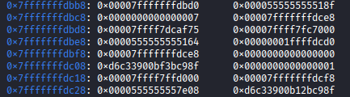
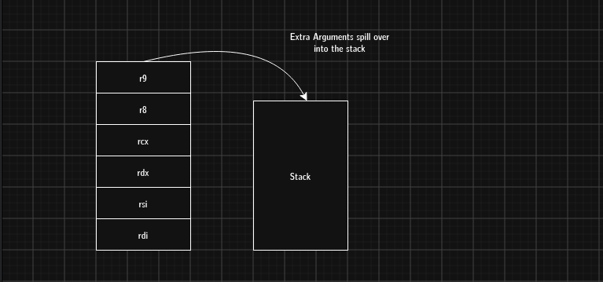

# Function Arguments in Stack Frames

Function arguments are the first layer of data placed when a function is called. They define how values are passed into a function, and depending on the architecture and calling convention, they may live in registers or spill onto the stack.

## How function arguments are stored

### Registers first

On System V AMD64, the first six integer or pointer arguments are passed in:

- `%rdi`
- `%rsi`
- `%rdx`
- `%rcx`
- `%r8`
- `%r9`

On Windows x64, the first four arguments are passed in:

- `%rcx`
- `%rdx`
- `%r8`
- `%r9`

### Stack spill

If there are more arguments than registers can hold, the remaining arguments are pushed onto the stack.

### Alignment

The stack pointer `%rsp` is often aligned to 16 bytes before a call. Extra padding may be inserted as needed to preserve alignment.

## Why this matters in exploitation

Understanding where arguments live is important because:

- buffer overflows can corrupt arguments that have spilled onto the stack
- ROP chains depend on correct register and stack layout
- reverse engineering often involves reconstructing function prototypes from disassembly

In the file `funcarg.c`:

- `a` -> `%rdi`
- `b` -> `%rsi`
- `c` -> `%rdx`
- `d` -> `%rcx`
- `e` -> `%r8`
- `f` -> `%r9`
- `g` -> pushed onto the stack

## Reading the stack

### Compile with debug symbols

```bash
gcc -O0 -g -fno-stack-protector funcarg.c -o funcarg
```

- `-O0` keeps the stack frame readable.
- `-g` includes debug symbols.
- `-fno-stack-protector` disables stack canaries so raw memory can be examined.

### Launch gdb

```bash
gdb ./funcarg
```

### Set a breakpoint at `sum`

```gdb
break sum
run
```

This stops execution exactly when `sum` is called.

### Inspect registers

```gdb
info registers
```

Observe the first six arguments in the registers.

### Inspect the stack

Dump memory at the current stack pointer:

```gdb
x/16gx $rsp
```

- `x` - examine memory
- `/16` - display 16 entries
- `g` - each entry is 8 bytes
- `$rsp` - start at the current stack pointer



The value `0x0000000000000007` represents the seventh argument. The surrounding entries may include return addresses, frame pointers, and runtime-library metadata.



