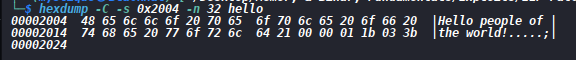

# ELF Patching

The goal of this exercise is to patch an ELF binary without rebuilding it from source.

## Step 1: Create and compile the ELF

A simple hello-world program was written in [hello.c](hello.c) and compiled into an ELF binary named [hello](hello).

```bash
gcc -o hello hello.c
```

## Step 2: Identify the ELF characteristics

Before modifying the binary, it is important to understand what kind of ELF it is.

```bash
file hello
readelf -h hello
```

This reveals:

- 64-bit vs 32-bit architecture
- endianness
- entry point
- whether the file is PIE or non-PIE
- the executable type

From the output, the binary is a 64-bit PIE executable on x86-64, with little-endian encoding.

## Step 3: Inspect the ELF structure

The next step is to inspect the sections and program headers.

```bash
readelf -S hello
readelf -l hello
```

Important sections include:

- `.text` - executable machine code
- `.rodata` - read-only constants and strings
- `.data` - initialized writable data
- `.bss` - uninitialized data
- `.symtab` - symbol table
- `.strtab` - string table

The program headers are equally important because the loader maps segments into memory, not sections.

## Step 4: Locate the code and string to modify

The objective is to change the text printed when the ELF is executed.

First, locate the string:

```bash
strings -t x hello
```

This reveals the string that appears in the binary. In this example, the target is:

```text
"2004 Hello people of the world!"
```

To find where the code references it, disassemble the binary:

```bash
objdump -d hello
```


The string is referenced from `main`.

## Step 5: Translate the virtual address to a file offset

A crucial concept in ELF patching is the conversion between a virtual address and the corresponding file offset.

The formula is:

```text
file offset = (virtual address - segment virtual address) + segment file offset
```

The target string is at a virtual address of `0x2004`.

The relevant segment contains that address, and in this case the values are:

- virtual address: `0x2004`
- segment virtual address: `0x2000`
- segment file offset: `0x2000`

This yields the file offset:

```text
0x2004
```

This matters because modifying the ELF on disk requires changing bytes at the file offset, not directly at the virtual address.

## Step 6: Inspect the raw bytes

Verify the bytes at the target location:

```bash
hexdump -C -s 0x2004 -n 32 hello
```



## Step 7: Prepare a backup

Before changing the binary, create a backup copy:

```bash
cp hello hello.bak
```

## Step 8: Modify the ELF

The actual patch is implemented in [patch_elf.py](patch_elf.py), which takes an ELF as input and patches the target bytes.

Make it executable:

```bash
chmod +x patch_elf.py
```

Then run the patching script.

## Step 9: Verify the patched result

Run the patched ELF to confirm the modified behavior.


This demonstrates that the binary has been successfully patched without rebuilding it from the original source code.

