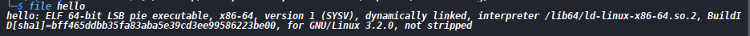
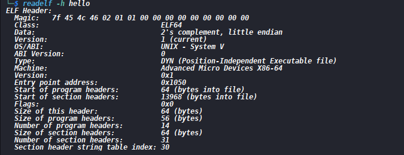
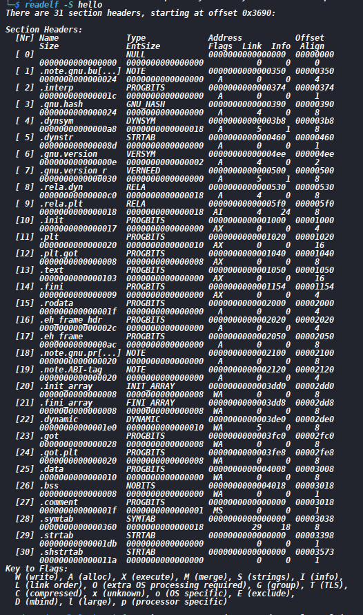
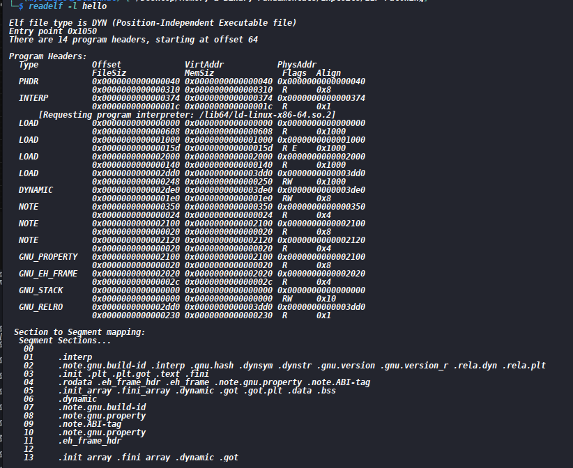
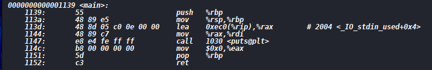

Goal: Patch an ELF Binary
Patching generally means modifying an existing executable without rebuilding it from source.
###  Step 1:  Create the code and compile it to an ELF 
For this case I creaed a simple hello world c program [source](hello.c).  And compiled it to ( ELF(hello)
To compile this I used gcc:
`gcc -o hello  hello.c`

### Step 2 : Identifying the target ELF
This is to determine what I am dealing with. The ELF is [hello](hello) but i need more details about the file such as:
(i) Is it 32 or 64-bit
(ii) Architecture
(iii) Endianness
(iv) PIE vs Non-PIE
(v) Entry point
(vi) Executable type.
The commands to use here are:
`file hello`

From the output above I was able to determine that the elf was a 64 bit PIE file
`readelf -h hello`

From the output its evident that the architecture is  Advanced Micro Devices x86-64 Indicated under the Machine Key. The endianness is littel endian under the data key. The entry point is shown by the address 0x1050 and the executable file is DYN ( Position Independent Executable File ).

###  Step 3: Examining the ELF structure.
By structure the reference is made to the section and segemnts of the file
For the sections the major ones of importance include:
(i) .text - executable machine code
(ii) .rodata - readonly constants or strings
(iii) .data - initialized writable data
(iv) .bss - uninitialized data
(v) .symtab - symbols if present
(vi) strtab - string table
The command :
`readelf -S hello`

The details of each section are clearly outlined. And in our case we have the .text .strtab .symtab and .data tab to focus on
The next structure to examine is the program headers or segments with the command. This is particularly important since the loader maps segments and not sections
`readelf -l hello`

It is also evident that the output gives a detail about the entry point and the file type .

###  Step 4 : Locating the code to modify
The modification to make for this elf is to change what gets printed when it is executed  to be different from what is in the source file.
(a) FInding the string 
`strings -t x hello `
From the output I saw that the string I was to change was : "2004 Hello people of the world!". The 2004 indicates the file offset
(b) Finding where the code references the string. - I will do this through disassembly of the elf
`objdump -d hello`

The strings was referenced in th main function .

### Step 5: Translating the virtual address to a file offset
This is an important ELF-Patching concept. What is to be kept in consideration is:
file offset = ( virtual address - segment virtual address ) + segment file offset.
Since it is the string that we are changing we need the virtual address of the strint which we found to be `0x2004` thus we find the offset of this address. 
The reason behind finding teh offset is because patching the ELF on disk requires modifying  the bytes at thef file offset no directly writing to the virtual address
