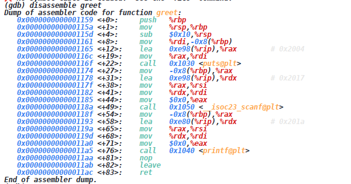
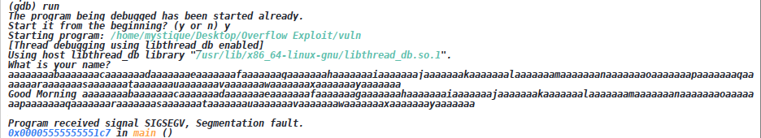
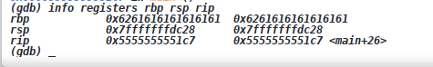
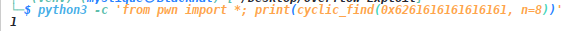
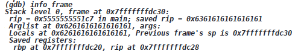
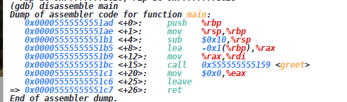
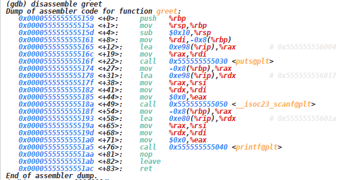
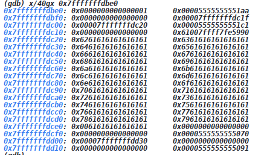

# Overflow Exploit

This exercise demonstrates how to analyze and trigger a stack-based buffer overflow against a deliberately vulnerable program.

## Objective

The vulnerable program accepts user input and prints it back without proper bounds checking. The goal is to determine how far input must travel before it overwrites the saved return address and to confirm that the overflow can be controlled.

## Step 1: Compile the vulnerable program

The source file [vulnerablefile.c](vulnerablefile.c) is compiled with protections disabled so the stack layout can be examined clearly:

```bash
gcc -g -O0 -fno-stack-protector -no-pie -z execstack vulnerablefile.c -o vuln
```

## Step 2: Run it under GDB

Start the debugger and load the executable:

```bash
gdb
file ./vuln
```

Inspect the binary's metadata:

```gdb
info files
```

Then disassemble the vulnerable function:

```gdb
disassemble greet
```




This reveals the stack frame, register usage, and the assembly pattern that handles the user input.

## Step 3: Generate a cyclic pattern

Use pwntools to create a repeated 8-byte pattern that helps identify the overwrite offset:

```bash
python3 -c 'from pwn import *; print(cyclic(200, n=8).decode())'
```

Feed that pattern into the program under GDB:

```gdb
run
```

The program should crash with a segmentation fault, which confirms that the overflow has reached control data.



Inspect the important registers:

```gdb
info registers rbp rsi rip
```



This allows you to see which stack values were overwritten and whether the saved base pointer or return address was reached.

## Step 4: Find the exact offset

Use pwntools to map the overwritten value back to its pattern position:

```bash
python3 -c 'from pwn import *; print(cyclic_find(0x6261616162616161, n=8))'
```

Then inspect the frame for the precise control-flow data:

```gdb
info frame
disassemble main
disassemble greet
x/40gx 0x7fffffffdbe0
```







The disassembly shows how the compiler positioned the local buffer relative to `rbp`, which explains why the first pattern match is not the final saved return-address offset. In this example, the actual offset to the return address is around 9 bytes from the beginning of the vulnerable buffer.

```bash
python3 -c 'from pwn import *; print(cyclic_find(0x6361616161616161))'
```

## Step 5: Build the exploit

The exploit structure is defined in [payload.py](payload.py), and the final exploit is implemented in [exploit.py](exploit.py).

Run it with:

```bash
python exploit.py
```

This confirms that the crafted payload overwrites the target stack slot and exercises the overflow path.

## Summary

This workflow demonstrates the standard process behind a stack-based overflow exploit:

- compile with mitigations disabled
- generate a cyclic payload
- inspect the crash state in GDB
- determine the exact overwrite offset
- craft a payload that reaches the saved return address

This is a foundational skill for understanding control-flow exploitation and memory corruption in binary analysis.

